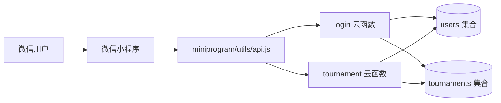

# Tennis Club 系统架构与业务上下文

## 业务最终目标

Tennis Club 是腾讯广州网球社内部使用的免费微信小程序。产品只解决两件事：管理员快速创建、组织和记录赛事；成员查看个人资料、排名与比赛记录。

团队赛的核心价值不是增加复杂赛制，而是把报名成员按水平分配到多片场地，在保留 A/B 队对抗的同时，让每片场地持续轮换、避免少数人长期占场。

## 产品边界

### 正式能力

- 赛事创建与管理：单打、双打、团队赛。
- 四种比分规则：四局制、六局制、单盘抢 7、单盘抢 11。
- 报名、抽签、分组、淘汰赛、场地轮转、比分录入和管理员撤回。
- 个人资料、NTRP、赛事积分、ELO（非团队赛）、排名与个人战绩。
- 团队赛固定积分：胜方成员 +40、负方成员 +20；团队赛不修改 ELO。

### 明确不做

- 不提供独立“活动创建”产品能力；历史 activity 云函数统一返回功能已下线。
- 不建设签到、请假审批、复杂排阵公平性管控或结束比赛重开。
- 不把测试夹具暴露在正式路由；夹具源码保留并继续要求 admin 权限。

## 运行架构

- 前端：原生微信小程序，页面状态使用各页面 `data/setData` 管理。
- 服务端：微信云开发 Node.js 云函数，使用 `wx-server-sdk ~2.6.3`。
- 数据库：微信云数据库，核心集合为 `users` 与 `tournaments`。
- 静态资源：小程序包内 assets；海报由 Canvas 在客户端生成。

## 核心模块

| 模块 | 职责 | 主要入口 |
|---|---|---|
| 赛事列表 | 分页展示赛事和报名状态 | `pages/match-list`、`tournament:list` |
| 赛事创建 | 创建单打、双打或团队赛 | `pages/tournament-create`、`tournament:create` |
| 赛事详情 | 报名、抽签、场地、录分、撤回、结算 | `pages/tournament-detail`、`tournament:*` |
| 个人中心 | 用户资料、积分/ELO、个人战绩 | `pages/profile`、`login:getProfile` |
| 成员与排名 | 管理员角色管理、积分榜 | `pages/member-management`、`pages/ranking` |
| 海报 | 生成赛事结果分享图 | `pages/poster`、`utils/poster-draw.js` |
| 研发夹具 | 构造团队赛等测试数据，仅 admin | `pages/test-fixtures`、`tournament:seed*` |

## 核心数据模型

### `users`

- 身份：`openid`、`wecomName`、`role`。
- 水平：`rating`、`eloRating`、`eloHistory`。
- 积分：`tournamentEarnings`、`totalPoints`。

### `tournaments`

- 基础字段：`title`、`type`、`bestOf`、`status`、`matchDate`、`creator`、`players`。
- 普通赛事：`groups[].matches` 与 `knockout.rounds[].matches` 保存对阵和比分。
- 团队赛：`teams` 是 A/B 队归属的权威源；`groups[0].matches[0].courts` 保存物理场地。
- 每个 `court` 保存混队人员 `players` 和自由轮换对局 `encounters`。
- 队际比分由所有 `courts[].encounters[].winner` 跨场汇总；平分时使用全局一球制胜。
- 团队赛完赛凭证保存在 `teamSettlement`，用于幂等结算和删除回滚。

## 权限边界

| 操作 | 创建者/管理员 | 场地内普通成员 | 其他成员 |
|---|---:|---:|---:|
| 创建赛事、抽签、调队/调场、结束比赛 | 是 | 否 | 否 |
| 新增或修改所在场地比分 | 是 | 是 | 否 |
| 撤回比分、删除赛事 | 是 | 否 | 否 |
| 查看赛事和个人战绩 | 是 | 是 | 是 |

所有权限以云函数校验为准，前端隐藏按钮只用于改善体验，不构成安全边界。

## 稳定性与性能策略

- 多场地录分、撤回、团队赛完赛和结算在数据库事务内重读最新赛事，避免并发覆盖。
- `teamSettlement` 保证重复结束请求不会重复发放积分；无结算凭证的历史完赛团队赛拒绝危险删除。
- 列表接口使用 cursor 分页和字段裁剪；个人档案最多读取最近 30 个赛事并只拉取战绩字段。
- 本地和 CI 共用 `scripts/verify.sh`，检查 JavaScript、JSON 与关键业务回归测试。
- 当前没有可证实的 SLA、P99 或峰值 QPS 数据，因此不在文档中填写虚构指标。

## 部署与验证

- 小程序和云函数通过微信开发者工具管理；云函数部署属于独立外部操作，不由 CI 自动执行。
- GitHub Actions 在 pull request 和 main push 上执行 release 验证 Gate，只拥有仓库只读权限。
- 正式发布前仍需用户在稳定版微信开发者工具和真机完成交互验收。

## 架构决策记录（ADR）

| ADR | 日期 | 决策 | 原因 | 状态 |
|---|---|---|---|---|
| ADR-001 | 2026-08-20 | 正式产品只保留赛事与个人管理，活动能力下线 | 符合免费小程序发布边界，避免重复产品概念 | 生效 |
| ADR-002 | 2026-08-20 | 团队赛使用 `courts + encounters`，而不是固定 slots | 支持每片场地自由轮换和跨场汇总 | 生效 |
| ADR-003 | 2026-08-20 | 团队赛使用固定 +40/+20，不修改 ELO | 团队结果不能准确代表个人竞技水平 | 生效 |
| ADR-004 | 2026-08-20 | 录分与结算采用事务和幂等凭证 | 防止并发丢分和重复发积分 | 生效 |
| ADR-005 | 2026-08-20 | 测试夹具保留源码但不进入正式路由 | 保留研发效率，同时隔离发布表面 | 生效 |

## 已知工程债

- `cloudfunctions/tournament/index.js` 约 3943 行，职责过多；应在发布稳定后按 action 域渐进拆分，并保持现有测试作为回归门禁。
- 微信开发者工具 RC 2.02.2607271 的 summer compiler 无法解析实际存在的全局 icon 组件；真实验收应改用稳定版工具。
- 当前没有生产级性能监控和错误率基线，遇到规模增长后再根据真实指标补充，不提前过度建设。
